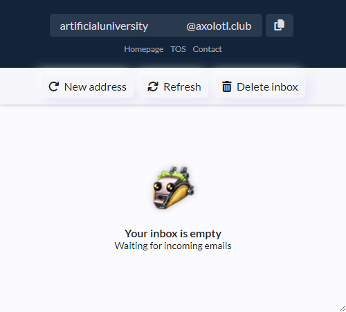
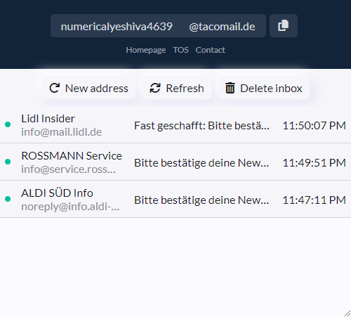
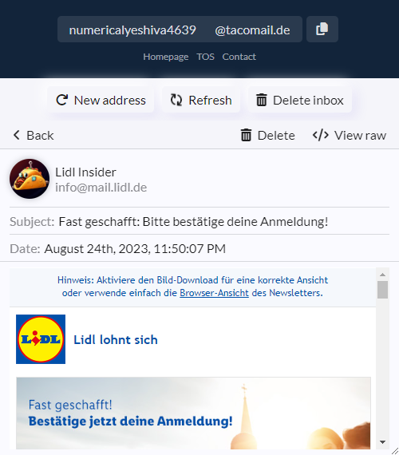

# TacoMail Extension
The TacoMail browser extension offers a hassle-free way to interact with the TacoMail temporary email service right from your browser. Safeguard your personal email and enjoy online privacy when signing up on websites.

The extension has been tested to work both with Chromium-based browsers and Firefox.

## Screenshots

## Development
Make sure [Node.js](https://nodejs.org/en) (Tested on v18.1.0) is installed on your system (either Windows, Linux or macOS).

### Debugging
1. Open a terminal inside this directory.
2. Install the required dependencies using `npm install`.
3. Run either `npm run debug:chrome` or `npm run debug:firefox` to open a browser instance with the plugin installed.

### Building
1. Open a terminal inside this directory.
2. Install the required dependencies using `npm install`.
3. Run `npm run buildExtension`.
4. The generated plugin file can be found in `web-ext-artifacts`.